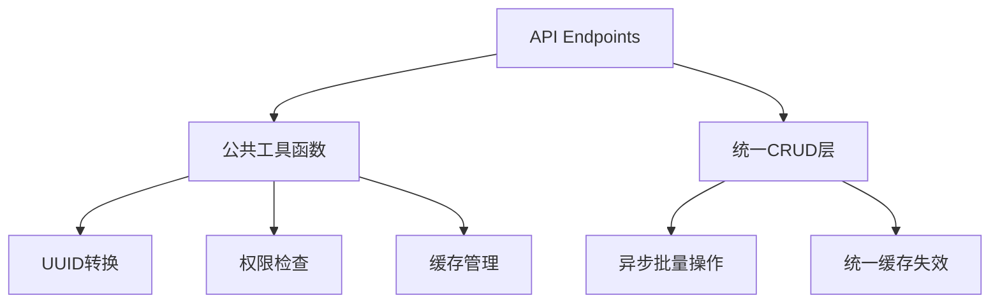

## 产品概述

对后端API接口进行全面代码优化，提升代码质量、性能和可维护性。

## 核心功能

- 消除代码重复：提取UUID转换、权限检查等公共逻辑为可复用函数
- 优化批量操作：使用SQLAlchemy bulk操作替代循环，提升性能
- 统一缓存策略：批量清除缓存，规范缓存失效逻辑
- 统一异步模式：将CRUD操作统一为异步，提高并发性能
- 规范日志记录：添加关键操作日志，统一日志级别
- 优化错误处理：统一异常处理和错误消息格式
- 提取验证逻辑：创建通用验证函数，减少重复代码

## 技术栈

- 后端框架：FastAPI + Python 3.11+
- ORM：SQLAlchemy 2.x
- 数据库：PostgreSQL
- 缓存：Redis（已集成）
- 日志：Python logging模块（已有logger工具）

## 技术架构

### 系统架构

采用分层架构，将重复逻辑提取到工具层，通过依赖注入实现复用：



### 实现方案

#### 1. 创建公共工具函数模块

在 `backend/app/utils/` 下创建新工具模块：

**`backend/app/utils/common_helpers.py`**

- `parse_uuid_list()`: 批量UUID字符串转UUID对象，统一错误处理
- `parse_uuid()`: 单个UUID字符串转UUID对象，统一错误处理
- `validate_batch_limit()`: 验证批量操作数量限制

**`backend/app/utils/permission_helpers.py`**

- `check_ownership()`: 通用所有权检查
- `check_edit_permission()`: 编辑权限检查
- `check_delete_permission()`: 删除权限检查

#### 2. 优化批量操作（基于现有CRUD）

在 `backend/app/crud/article.py` 中添加批量操作函数：

- `batch_delete_articles()`: 使用 `db.query(Article).filter(...).delete(synchronize_session=False)` 批量删除
- `batch_update_articles()`: 使用 `update()` 语句批量更新
- 在 `backend/app/crud/comment.py`、`backend/app/crud/message.py` 中添加类似批量操作

批量清除缓存：使用 `cache_service.mset()` 和 `cache_service.delete_pattern()` 替代循环删除

#### 3. 统一异步模式

将CRUD层函数改为async：

- 使用 `async def` 定义CRUD函数
- 对于数据库操作，使用 `asyncio.to_thread()` 或考虑使用 SQLAlchemy AsyncSession（如已配置）
- 保持endpoint层的async特性，与CRUD层匹配

#### 4. 统一日志记录

在关键操作处添加日志：

- 使用 `app_logger.info()` 记录正常操作
- 使用 `app_logger.warning()` 记录业务警告
- 使用 `app_logger.error()` 记录异常，包含 `exc_info=True`

日志格式：`"[操作] [资源] [详情]"`，如 `"创建文章成功 id=xxx"`

#### 5. 优化缓存策略

- 批量操作后使用 `cache_service.delete_pattern("article:*")` 清除相关缓存
- 使用 `cache_service.mset()` 批量设置缓存
- 为列表查询添加缓存装饰器（基于现有 `cache_utils.py`）

#### 6. 统一错误处理

使用 `app/utils/response.py` 中的统一响应模型：

- 成功：`success_response()`
- 错误：`error_response()`, `not_found_response()`, `forbidden_response()`
- 错误消息格式统一为中文："资源不存在"、"权限不足"等

## 实现细节

### 目录结构

```
backend/
├── app/
│   ├── crud/
│   │   ├── article.py          # [MODIFY] 添加批量CRUD函数
│   │   ├── comment.py          # [MODIFY] 添加批量操作
│   │   └── message.py          # [MODIFY] 添加批量操作
│   ├── api/v1/endpoints/
│   │   ├── articles.py         # [MODIFY] 使用公共工具函数，优化批量操作
│   │   ├── categories.py       # [MODIFY] 使用parse_uuid工具
│   │   ├── tags.py             # [MODIFY] 使用parse_uuid工具
│   │   ├── messages.py         # [MODIFY] 使用parse_uuid工具
│   │   ├── comments.py         # [MODIFY] 使用权限检查工具
│   │   └── users.py            # [MODIFY] 统一日志和错误处理
│   └── utils/
│       ├── common_helpers.py   # [NEW] UUID解析、批量验证等公共函数
│       └── permission_helpers.py  # [NEW] 权限检查公共函数
```

### 关键代码结构

**common_helpers.py - UUID解析**

```python
from typing import List, Optional
from uuid import UUID
from fastapi import HTTPException, status

def parse_uuid(uuid_str: str, error_detail: str = "Invalid ID format") -> UUID:
    """解析UUID字符串，统一错误处理"""
    try:
        return UUID(uuid_str)
    except ValueError:
        raise HTTPException(
            status_code=status.HTTP_400_BAD_REQUEST,
            detail=error_detail
        )

def parse_uuid_list(uuid_strs: List[str], max_count: int = 100) -> List[UUID]:
    """批量解析UUID列表"""
    if len(uuid_strs) > max_count:
        raise HTTPException(
            status_code=status.HTTP_400_BAD_REQUEST,
            detail=f"一次最多操作{max_count}个项目"
        )
    try:
        return [UUID(uid) for uid in uuid_strs]
    except ValueError:
        raise HTTPException(
            status_code=status.HTTP_400_BAD_REQUEST,
            detail="Invalid ID format"
        )
```

**permission_helpers.py - 权限检查**

```python
from typing import Type
from sqlalchemy.orm import Session
from app.models.user import User

def check_ownership(
    resource: Type,
    resource_id,
    user: User,
    db: Session,
    superuser_bypass: bool = True
):
    """检查资源所有权"""
    if superuser_bypass and user.is_superuser:
        return
    
    resource_obj = db.query(resource).filter(resource.id == resource_id).first()
    if not resource_obj:
        raise HTTPException(status_code=404, detail="资源不存在")
    
    if getattr(resource_obj, 'author_id', None) != user.id:
        raise HTTPException(status_code=403, detail="权限不足")
```

**article.py - 批量删除优化**

```python
from sqlalchemy.orm import Session
from typing import List
from uuid import UUID

async def batch_delete_articles(db: Session, article_ids: List[UUID]) -> int:
    """批量删除文章，使用SQLAlchemy批量删除"""
    deleted_count = db.query(Article).filter(
        Article.id.in_(article_ids)
    ).delete(synchronize_session=False)
    db.commit()
    return deleted_count
```

## 性能优化

- 批量操作减少数据库往返：从O(n)到O(1)
- 缓存批量操作减少Redis连接：使用mset/mget
- UUID解析统一异常处理避免重复try-except

## 兼容性

- 保持API响应格式不变
- 保持endpoint路径不变
- 向后兼容现有前端调用