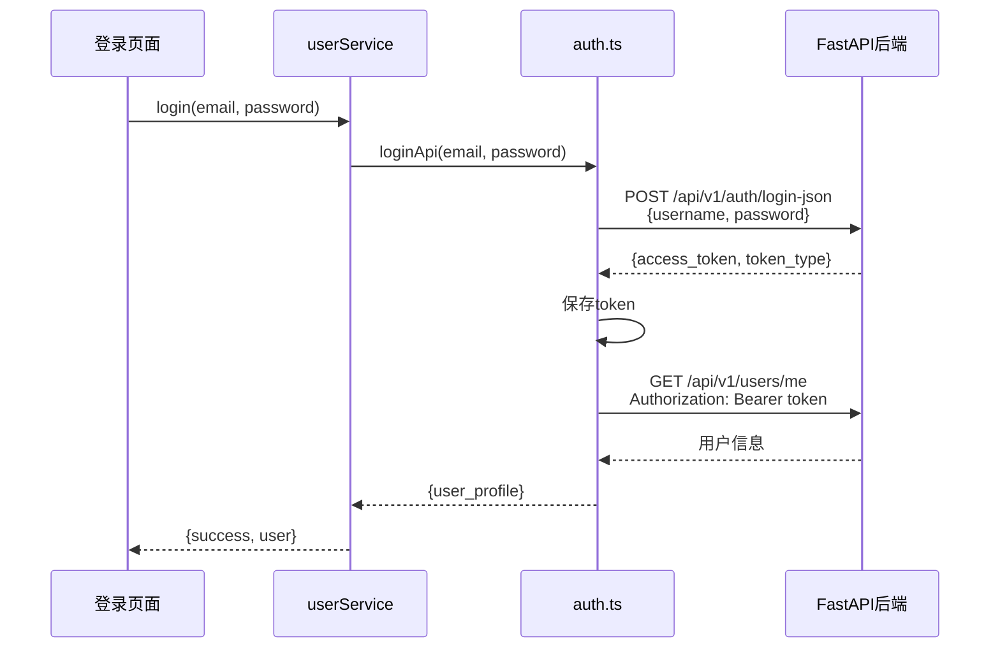

## 产品概述

修复登录功能的多个问题，包括HTML标签重复、API参数不匹配、错误处理不当等。

## 核心功能

- 移除登录页面layout中的重复HTML标签
- 修复登录API参数（email改为username）
- 添加获取当前用户信息的API调用
- 改进错误处理和消息显示
- 创建API配置文件统一管理后端URL

## 技术栈

- 前端框架：Next.js + TypeScript
- 后端框架：FastAPI (Python)
- HTTP客户端：Fetch API

## 实现方案

采用分步骤修复的方式，从最关键的问题开始：

### 关键技术决策

1. **移除重复HTML标签**：Next.js只有根layout可以包含`<html>`和`<body>`标签，其他layout必须移除
2. **统一API配置**：创建config文件管理后端URL，避免硬编码
3. **参数名修正**：后端期望`username`，前端发送`email`，改为username
4. **两步登录流程**：先登录获取token，再调用/me获取用户信息
5. **错误处理改进**：正确解析FastAPI的422错误和其他错误响应

### 性能与可靠性

- 使用环境变量配置API URL，便于开发/生产环境切换
- 错误消息提取逻辑优先使用detail字段，兼容后端错误格式

## 实现细节

### 关键目录结构

```
frontend/src/
├── config/
│   └── api.ts              # [NEW] API配置，定义BASE_URL
├── lib/
│   └── api/
│       ├── auth.ts           # [MODIFY] 修复参数名、添加/me端点、改进错误处理
│       └── profile.ts        # [MODIFY] 使用完整的API URL
├── services/
│   └── userService.ts       # [MODIFY] 正确处理API响应数据
└── app/
    └── login/
        ├── layout.tsx        # [MODIFY] 移除html/body标签
        └── page.tsx         # [VERIFY] 登录表单使用email状态但参数名是username
```

### 修改内容

**api.ts (NEW)**：定义API_BASE_URL常量，支持环境变量配置

**auth.ts (MODIFY)**：

- 参数：email → username
- URL：/api/v1/auth/login → `${API_BASE_URL}/api/v1/auth/login-json`
- 新增：getCurrentUserApi()函数调用/me端点
- 错误处理：正确解析FastAPI的ValidationError（422）格式

**profile.ts (MODIFY)**：所有fetch调用使用完整的API_BASE_URL

**userService.ts (MODIFY)**：

- loginUser(): 调用loginApi → 获取token → 调用getCurrentUserApi → 返回完整用户信息
- 错误提取：error.detail || error.message || default message

**layout.tsx (MODIFY)**：移除`<html>`和`<body>`标签，只保留ThemeWrapper和main

## 架构设计



## 目录结构

```
frontend/src/
├── config/
│   └── api.ts                  # [NEW] API配置文件
├── lib/api/
│   ├── auth.ts                 # [MODIFY] 修复参数和URL，添加/me端点
│   └── profile.ts              # [MODIFY] 使用完整URL
├── services/
│   └── userService.ts          # [MODIFY] 两步登录流程
└── app/login/
    ├── layout.tsx              # [MODIFY] 移除HTML标签
    ├── page.tsx               # [VERIFY] 参数映射
    └── form-styles.css        # 保持不变
```

## 关键代码结构（可选）

```typescript
// config/api.ts
export const API_BASE_URL = process.env.NEXT_PUBLIC_API_URL || 'http://127.0.0.1:8989';

// lib/api/auth.ts
export const loginApi = async (username: string, password: string) => {
  const response = await fetch(`${API_BASE_URL}/api/v1/auth/login-json`, {
    method: 'POST',
    headers: { 'Content-Type': 'application/json' },
    body: JSON.stringify({ username, password }),
  });
  // ... 错误处理改进
};

export const getCurrentUserApi = async () => {
  const token = getAuthToken();
  const response = await fetch(`${API_BASE_URL}/api/v1/users/me`, {
    headers: { 'Authorization': `Bearer ${token}` },
  });
  // ... 返回用户信息
};
```