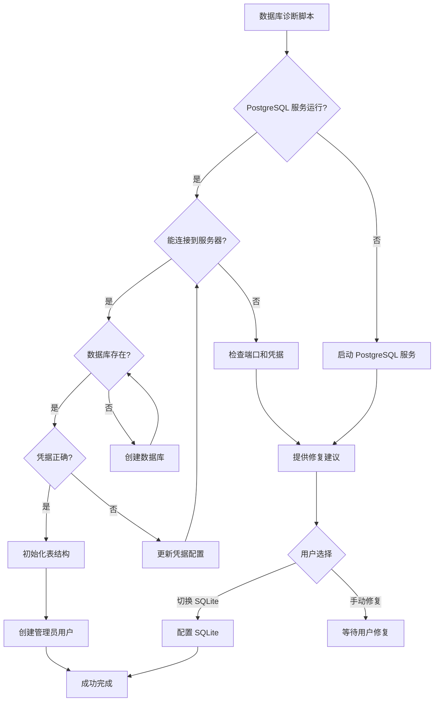

## 产品概述

诊断并修复 PostgreSQL 数据库连接问题，包括检查数据库是否存在、验证用户凭据，并提供解决方案。

## 核心功能

- 数据库连接诊断和故障排除
- 数据库存在性检查
- 用户凭据验证
- 自动创建缺失的数据库
- 灵活切换到 SQLite 作为备选方案
- 提供详细的错误信息和修复建议

## 技术栈

- Python 3.x
- psycopg2（PostgreSQL 数据库驱动）
- bcrypt（密码哈希）

## 技术架构

### 系统架构



### 模块划分

- **诊断模块**: 检查 PostgreSQL 服务状态、数据库存在性、连接参数有效性
- **数据库创建模块**: 在 PostgreSQL 中创建缺失的数据库
- **初始化模块**: 创建所有必需的表和管理员用户
- **配置管理模块**: 更新 .env 文件中的连接参数
- **回退方案模块**: 提供切换到 SQLite 的选项

### 数据流


## 实现细节

### 核心目录结构

```
e:/A_Project/my-awesome-blog/backend/
├── scripts/
│   └── diagnose_db.py           # 新增: 数据库诊断脚本
│   └── fix_db_connection.py     # 新增: 数据库修复脚本
├── .env                          # 修改: 数据库配置文件
└── README.md                     # 修改: 添加数据库配置说明
```

### 关键代码结构

**数据库诊断函数**: 检查 PostgreSQL 服务状态和数据库连接

```python
def diagnose_database():
    """诊断数据库连接问题"""
    # 1. 检查服务状态
    # 2. 检查端口监听
    # 3. 检查数据库存在
    # 4. 验证用户凭据
    # 5. 返回诊断结果
```

**数据库创建函数**: 创建缺失的数据库

```python
def create_database():
    """连接到 PostgreSQL 服务器并创建数据库"""
    # 连接到 postgres 默认数据库
    # 执行 CREATE DATABASE 语句
```

**修复配置函数**: 更新连接参数

```python
def update_env_config(new_config):
    """更新 .env 文件中的配置"""
    # 读取 .env 文件
    # 更新 DATABASE_URL
    # 写回文件
```

### 技术实现计划

#### 诊断实现

1. **问题**: 需要检查多个数据库连接相关因素
2. **方案**: 创建综合诊断脚本，逐一检查各项因素
3. **关键步骤**:

- 检查 Windows 服务状态（通过 subprocess 调用 sc 命令）
- 尝试 TCP 端口连接（socket 测试）
- 尝试 PostgreSQL 连接
- 查询数据库列表检查目标数据库是否存在
- 返回详细诊断报告

#### 自动修复实现

1. **问题**: 数据库不存在导致连接失败
2. **方案**: 提供自动创建数据库的选项
3. **关键步骤**:

- 连接到 PostgreSQL 默认数据库（postgres）
- 执行 CREATE DATABASE my_awesome_blog
- 验证数据库创建成功
- 继续初始化表结构

#### 灵活配置实现

1. **问题**: 用户凭据可能不匹配
2. **方案**: 支持通过环境变量或输入新凭据更新配置
3. **关键步骤**:

- 检测密码错误
- 提示用户输入正确密码
- 更新 .env 文件
- 重新验证连接

#### SQLite 回退方案

1. **问题**: PostgreSQL 无法使用时需要备选方案
2. **方案**: 提供切换到 SQLite 的选项
3. **关键步骤**:

- 询问用户是否切换到 SQLite
- 修改 .env 中的 DATABASE_URL
- 提供 SQLite 初始化脚本
- 验证 SQLite 连接

### 集成点

- 与现有 .env 配置文件集成
- 与现有数据库初始化脚本（windows_init_db.py）配合使用
- 与 docker-compose.yml 配置保持一致性（备选）

## 技术注意事项

### 性能优化

- 使用连接池（如果需要频繁操作）
- 缓存诊断结果避免重复检查

### 安全措施

- 密码在内存中处理时不以明文输出
- 提示用户不要在生产环境使用默认密码
- .env 文件不应提交到版本控制

### 可扩展性

- 支持将来添加更多数据库类型（如 MySQL）
- 诊断报告可扩展包含更多信息
- 修复脚本可模块化以处理更多场景