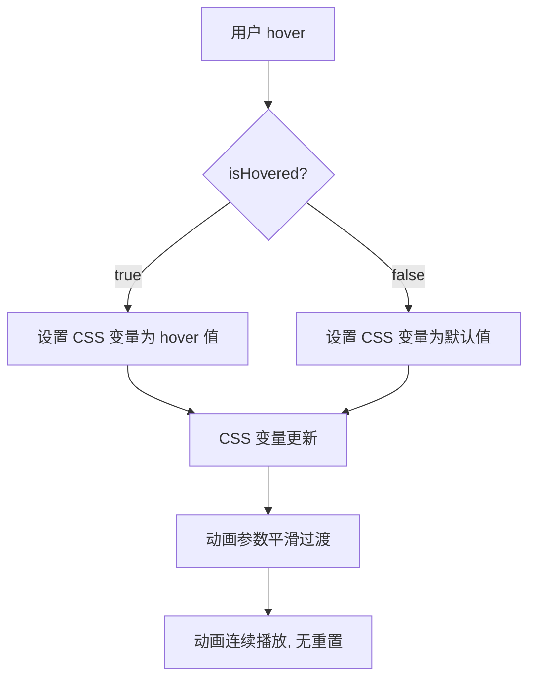

## 产品概述

修复 rope-theme-toggler 组件在 hover 时绳子摇摆动画重置的问题

## 核心功能

- 使用 CSS 变量（--swing-angle 和 --swing-duration）控制动画参数
- 保持类名不变，避免 hover 时动画重新开始
- 正常状态和 hover 状态平滑过渡动画效果

## 技术栈

- 前端框架: React + TypeScript
- 样式方案: Tailwind CSS + 自定义 CSS

## 技术架构

### 问题分析

当前实现在 `rope-theme-toggler.tsx` 第 141 行通过切换类名（`rope-swing` / `rope-swing-hover`）改变 hover 动画，导致动画重新开始。

**当前代码结构：**

```
// rope-theme-toggler.tsx 第 138-146 行
<div 
  className={cn(
    "swing-container relative flex flex-col items-center",
    isPulling ? "rope-pull" : (isHovered ? "rope-swing-hover" : "rope-swing")
  )}
  style={{ 
    transformOrigin: 'top center'
  } as React.CSSProperties}
>
```

**CSS 动画定义（globals.css）：**

```css
@keyframes rope-swing {
  0%, 100% { transform: rotate(-3deg); }
  50% { transform: rotate(3deg); }
}

@keyframes rope-swing-hover {
  0%, 100% { transform: rotate(-5deg); }
  50% { transform: rotate(5deg); }
}

.rope-swing {
  animation: rope-swing 4s ease-in-out infinite;
}

.rope-swing-hover {
  animation: rope-swing-hover 2s ease-in-out infinite;
}
```

### 解决方案

使用 CSS 变量替代硬编码的角度和时长，保持类名不变，通过内联样式动态修改 CSS 变量值。

**修改后的数据流：**



## 实现细节

### 修改文件清单

```
frontend/src/components/ui/rope-theme-toggler.tsx  # 修改类名逻辑
frontend/src/styles/globals.css                     # 修改动画定义
```

### 关键代码结构

**1. CSS 动画重构（globals.css）：**
使用 CSS 变量替代硬编码值

```css
/* 统一的摇摆动画定义 */
@keyframes rope-swing {
  0%, 100% { 
    transform: rotate(calc(var(--swing-angle, -3deg) * -1)); 
  }
  50% { 
    transform: rotate(var(--swing-angle, 3deg)); 
  }
}

/* 统一的摇摆容器类 - 使用 CSS 变量控制参数 */
.rope-swing {
  animation: rope-swing var(--swing-duration, 4s) ease-in-out infinite;
}

/* 拉动动画保持不变 */
@keyframes rope-pull {
  0%, 100% { transform: translateY(0); }
  50% { transform: translateY(30px); }
}

.rope-pull {
  animation: rope-pull 0.3s ease-in-out;
}
```

**2. React 组件修改（rope-theme-toggler.tsx）：**
保持类名不变，通过内联样式设置 CSS 变量

```
// 计算动画参数
const swingParams = useMemo(() => {
  if (isPulling) {
    return {
      '--swing-angle': '0deg',
      '--swing-duration': '0s'
    };
  }
  return isHovered 
    ? { '--swing-angle': '5deg', '--swing-duration': '2s' }
    : { '--swing-angle': '3deg', '--swing-duration': '4s' };
}, [isPulling, isHovered]);

// 应用到容器
<div 
  className={cn(
    "swing-container relative flex flex-col items-center",
    isPulling ? "rope-pull" : "rope-swing"
  )}
  style={{ 
    transformOrigin: 'top center',
    ...swingParams
  } as React.CSSProperties}
>
```

### 技术实现计划

1. **重构 CSS 动画定义**

- 将 `rope-swing` 和 `rope-swing-hover` 动画合并
- 使用 `var(--swing-angle)` 和 `var(--swing-duration)` 变量
- 保留 `rope-pull` 动画不变

2. **修改 React 组件逻辑**

- 移除条件类名切换（`rope-swing` / `rope-swing-hover`）
- 使用 `useMemo` 计算动画参数对象
- 通过内联样式设置 CSS 变量

3. **测试验证**

- 测试正常状态下的摇摆动画（3deg, 4s）
- 测试 hover 状态下的摇摆动画（5deg, 2s）
- 验证动画平滑过渡，无重置现象

## 技术考虑

### 性能优化

- CSS 变量更新性能优于类名切换，避免 DOM 重排
- `useMemo` 缓存计算结果，减少重复计算

### 兼容性

- CSS 变量在现代浏览器中广泛支持
- 不影响现有功能（主题切换、下拉动画）

### 可维护性

- 动画参数集中在组件逻辑中管理
- CSS 定义更简洁，避免重复代码