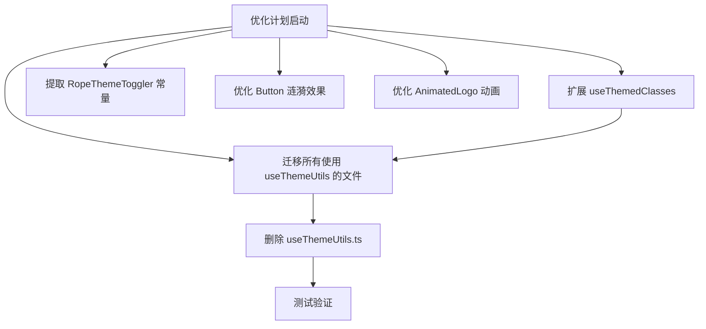

## 产品概述

对前端代码进行全面优化，包括移除废弃的 Hook、提取硬编码常量、统一主题处理逻辑、优化动画效果。

## 核心功能

1. **移除 useThemeUtils.ts 并迁移使用**：将 useThemeUtils 的功能合并到 useThemedClasses，更新所有引用文件
2. **提取 RopeThemeToggler 硬编码值为常量**：将重复的渐变色值提取为常量，提高可维护性
3. **统一主题处理逻辑**：推广 useThemedClasses 的使用，减少重复的主题判断代码
4. **优化 Button 组件涟漪效果**：改进涟漪动画实现，避免频繁 DOM 操作
5. **优化 AnimatedLogo 动画效果**：增强 Logo 的动画效果，提升用户体验

## 技术栈

- 前端框架：React + TypeScript + Next.js
- 样式方案：Tailwind CSS + CSS 变量
- 动画：CSS Animations + React Hooks

## 技术架构

### 系统架构

采用模块化优化策略，逐个文件进行重构和优化，确保向后兼容。



### 实现方案

#### 1. 扩展 useThemedClasses Hook

将 useThemeUtils 的功能合并到 useThemedClasses，提供：

- 通用的主题类快捷访问
- getThemeClass 方法（向后兼容）
- getThemeStyles 方法
- isDarkTheme / isLightTheme 方法

#### 2. RopeThemeToggler 常量提取

创建常量文件或在组件顶部定义颜色常量，用于：

- ropeColor 默认值
- 固定点装饰渐变
- 绳结装饰渐变

#### 3. Button 涟漪效果优化

使用 CSS 变量和预定义的 @keyframes 动画，避免动态创建 DOM 元素。考虑使用伪元素或固定的 span 元素池。

#### 4. AnimatedLogo 动画优化

添加更流畅的动画效果：

- SVG 路径动画
- 图标缩放和旋转
- 文字淡入淡出效果

### 模块划分

**主题处理模块**：

- `frontend/src/hooks/useThemedClasses.ts` - 扩展功能
- `frontend/src/hooks/useThemeUtils.ts` - 待删除

**UI 组件优化**：

- `frontend/src/components/ui/rope-theme-toggler.tsx` - 提取常量
- `frontend/src/components/ui/Button.tsx` - 优化涟漪效果
- `frontend/src/components/navigation/AnimatedLogo.tsx` - 优化动画

**页面组件迁移**（11个文件）：

- `frontend/src/components/ui/PostCard.tsx`
- `frontend/src/app/profile/page.tsx`
- `frontend/src/app/profile/components/ProfileView.tsx`
- `frontend/src/app/articles/page.tsx`
- `frontend/src/app/articles/[id]/page.tsx`
- `frontend/src/app/articles/[id]/enhanced-article.tsx`
- `frontend/src/app/articles/components/SidebarTagCloud.tsx`
- `frontend/src/app/articles/components/MiniStats.tsx`
- `frontend/src/app/articles/components/HotArticles.tsx`
- `frontend/src/app/articles/components/CategoryNav.tsx`
- `frontend/src/app/articles/components/ArticleSidebar.tsx`

### 数据流

```
用户交互 → 组件渲染 → useThemedClasses 返回主题类 → UI 更新
```

## 实现细节

### 核心目录结构

```
frontend/src/
├── hooks/
│   ├── useThemedClasses.ts      # [MODIFY] 扩展功能，合并 useThemeUtils
│   └── useThemeUtils.ts          # [DELETE] 迁移完成后删除
├── components/
│   ├── ui/
│   │   ├── rope-theme-toggler.tsx  # [MODIFY] 提取硬编码常量
│   │   └── Button.tsx              # [MODIFY] 优化涟漪效果实现
│   └── navigation/
│       └── AnimatedLogo.tsx        # [MODIFY] 优化动画效果
├── app/
│   ├── profile/
│   │   ├── page.tsx               # [MODIFY] 迁移到 useThemedClasses
│   │   └── components/
│   │       └── ProfileView.tsx    # [MODIFY] 迁移到 useThemedClasses
│   └── articles/
│       ├── page.tsx               # [MODIFY] 迁移到 useThemedClasses
│       ├── [id]/
│       │   ├── page.tsx           # [MODIFY] 迁移到 useThemedClasses
│       │   └── enhanced-article.tsx # [MODIFY] 迁移到 useThemedClasses
│       └── components/
│           ├── SidebarTagCloud.tsx  # [MODIFY] 迁移到 useThemedClasses
│           ├── MiniStats.tsx       # [MODIFY] 迁移到 useThemedClasses
│           ├── HotArticles.tsx     # [MODIFY] 迁移到 useThemedClasses
│           ├── CategoryNav.tsx     # [MODIFY] 迁移到 useThemedClasses
│           └── ArticleSidebar.tsx  # [MODIFY] 迁移到 useThemedClasses
└── components/ui/PostCard.tsx       # [MODIFY] 迁移到 useThemedClasses
```

### 关键代码结构

#### useThemedClasses 扩展后的接口

```typescript
export interface ThemedClasses {
  // 现有预定义类
  dropdownBgClass: string;
  dropdownItemClass: string;
  textColorClass: string;
  separatorClass: string;
  dropdownShadowClass: string;
  
  // 新增通用类
  textClass: string;
  mutedTextClass: string;
  borderClass: string;
  cardBgClass: string;
}

export interface ThemedUtils {
  getThemeClass(darkClass: string, lightClass: string): string;
  getThemeStyles(darkStyles: React.CSSProperties, lightStyles: React.CSSProperties): React.CSSProperties;
  isDarkTheme(): boolean;
  isLightTheme(): boolean;
  currentTheme: string | undefined;
}

export const useThemedClasses = (): {
  resolvedTheme: string | undefined;
  themedClasses: ThemedClasses;
} & ThemedUtils;
```

#### RopeThemeToggler 常量定义

```typescript
const ROPE_THEME_CONSTANTS = {
  DEFAULT_ROPE_COLOR: 'from-[#D4A574] to-[#8B4513]',
  FIXED_POINT_GRADIENT: 'linear-gradient(to bottom, #C4956A, #8B4513)',
  KNOT_GRADIENT: 'linear-gradient(to bottom, #C4956A, #8B4513)',
} as const;
```

## 设计风格

保持现有项目的科技感设计风格，优化动画效果使其更加流畅和精致。

## 优化重点

1. **动画流畅性**：使用 CSS transforms 和 opacity 优化动画性能
2. **交互反馈**：增强涟漪效果的视觉反馈
3. **品牌一致性**：保持现有的 tech-cyan 和其他设计颜色的一致使用
4. **性能优化**：减少不必要的 DOM 操作和重绘

## 设计原则

- 微妙精致的动画，不破坏用户体验
- 保持视觉一致性
- 遵循无障碍设计原则（prefers-reduced-motion）
- 向后兼容，不破坏现有功能