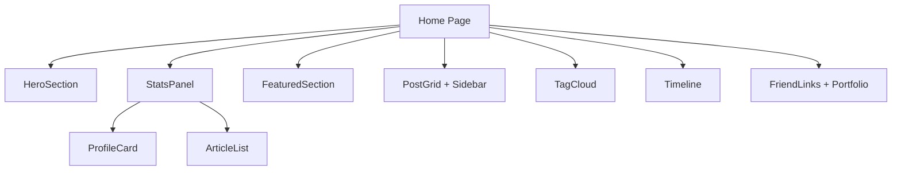

## 产品概述

对博客首页布局进行调整，删除面包屑导航，优化内容展示顺序，提升用户体验。

## 核心功能

- 删除Breadcrumb面包屑导航组件
- 将个人卡片和最新文章组件移动到HeroSection下方
- 采用水平并排布局展示个人卡片和最新文章

## 技术栈

- 前端框架：Next.js 14 (React 18 + TypeScript)
- 样式方案：Tailwind CSS
- 组件库：Radix UI + 自定义UI组件

## 架构设计

### 修改范围

本次任务仅涉及首页组件布局调整，使用现有StatsPanel组件替换ProfilePanel组件。

### 组件结构说明

```
Home Page
├── HeroSection
├── StatsPanel (新增，水平并排布局)
│   ├── ProfileCard (个人卡片，左1列)
│   └── ArticleList (最新文章，右2列)
├── FeaturedSection
├── PostGrid + Sidebar
├── TagCloud
├── Timeline
└── FriendLinks + Portfolio
```

### 数据流



## 实现细节

### 核心修改

修改文件：`frontend/src/app/page.tsx`

**具体改动：**

1. 删除Breadcrumb导入（第13行）
2. 删除Breadcrumb使用代码块（第153-159行）
3. 添加StatsPanel导入
4. 将ProfilePanel组件替换为StatsPanel（第161-163行）

### 修改前后对比

**修改前：**

```
// 第13行
import Breadcrumb from '@/components/Breadcrumb';

// 第151-163行
<HeroSection />

<div className="container mx-auto px-4 py-6">
  <Breadcrumb items={[{ label: '首页', href: '/', active: true }]} />
</div>

<div className="container mx-auto px-4 py-16 bg-background">
  <ProfilePanel />
</div>
```

**修改后：**

```
// 删除Breadcrumb导入
// 新增StatsPanel导入
import StatsPanel from '@/components/home/StatsPanel';

// 第151行后
<HeroSection />

<div className="container mx-auto px-4 py-16 bg-background">
  <StatsPanel />
</div>
```

### 组件说明

- **StatsPanel**：已存在的组件，包含个人卡片(ProfileCard)和最新文章(ArticleList)，采用3列网格布局（左侧1列个人卡片，右侧2列最新文章）
- **ProfileCard**：展示个人信息、头像、统计数据和友站链接
- **ArticleList**：展示最新文章列表，支持加载状态和错误处理

## 技术考量

### 兼容性

- StatsPanel组件已存在并测试过，直接使用无需额外开发
- 保持响应式设计，在移动端自动切换为垂直堆叠布局

### 性能

- 使用已有的组件，无需新增网络请求
- StatsPanel内置加载状态和骨架屏，提升用户体验

### 维护性

- 代码改动最小化，仅修改page.tsx单个文件
- 使用现有组件，避免引入新的维护成本