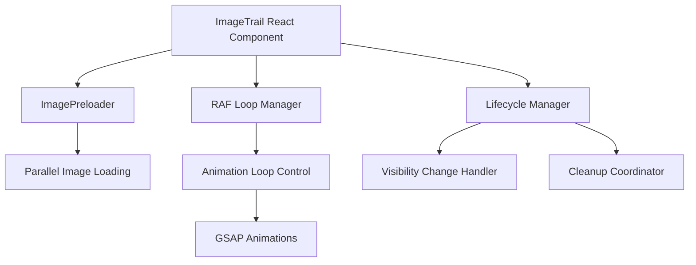

## 问题诊断

ImageTrail 组件动画时有时无的根本性问题：

1. **竞态条件问题**：React 组件在 `items.length` 变化时重新初始化，但 DOM 元素重建和类实例初始化之间存在竞态条件。旧的 `ImageTrail` 实例可能引用已不存在的 DOM 元素

2. **RAF 循环管理缺陷**：`requestAnimationFrame` 循环管理不完善，在快速重新初始化时可能导致：

- 多个 RAF 循环同时运行
- `isRunning` 状态不一致
- 旧实例的动画未完全清理

3. **图片预加载缺失**：动画开始时图片可能尚未加载完成，导致：

- 图片闪现或空白
- 动画卡顿
- 浏览器重绘性能问题

4. **事件处理不稳定**：鼠标事件在以下场景可能失效：

- 页面切换后返回
- 快速移动时事件丢失
- 触摸设备兼容性问题

5. **页面可见性未处理**：切换浏览器标签页后：

- RAF 循环继续运行但不可见
- 返回页面时动画状态不一致
- 资源浪费

6. **DOM 选择器不可靠**：使用 `querySelectorAll` 选择图片元素，在 React 重新渲染后可能选到错误的元素或空数组

## 技术方案

### 核心优化策略

#### 1. 双重初始化保护机制

- 引入初始化锁（`isInitializing`）防止并发初始化
- 使用 `queueMicrotask` 确保 DOM 渲染完成后再初始化类实例
- 添加初始化超时检测和自动重试

#### 2. RAF 循环管理重构

- 使用 `Map` 管理多个 RAF ID，确保全部清理
- 添加全局 RAF 计数器检测循环泄漏
- 实现 `visibilitychange` 事件暂停/恢复 RAF

#### 3. 图片预加载系统

- 实现 `ImageLoader` 类并行预加载所有图片
- 添加加载进度回调，等待全部加载完成再启用动画
- 缓存已加载图片 URL 避免重复加载

#### 4. 事件处理增强

- 使用 `pointer-events` 统一处理鼠标和触摸
- 添加 `pointerrawupdate` 事件捕获快速移动
- 实现事件节流和防抖平衡性能与响应

#### 5. 页面生命周期管理

- 监听 `visibilitychange` 事件
- 页面隐藏时自动暂停动画并保存状态
- 页面显示时恢复动画状态

#### 6. React 组件重构

- 使用 `key` 强制完全重渲染解决 DOM 引用问题
- 拆分 `useEffect` 逻辑，分别处理初始化、清理、事件绑定
- 添加 `useCallback` 稳定事件处理器引用

### 关键技术决策

| 决策点 | 选择 | 理由 |
| --- | --- | --- |
| DOM 引用方式 | 从 querySelectorAll 改为 props 传递 refs | 避免 React 渲染后选择器失效 |
| 动画库 | 保留 GSAP | 已使用且功能强大，优化调用方式 |
| 预加载策略 | 并行加载 + Promise.all | 最小化加载时间 |
| 状态管理 | 使用 React ref + class instance state | 避免不必要的状态更新 |
| 性能优化 | will-change + transform 硬件加速 | 确保 60fps 流畅度 |

### 架构改进

### 性能优化点

1. **内存管理**：Dispose 时清理所有引用、事件监听器、RAF
2. **渲染优化**：使用 `transform` 和 `opacity` 触发 GPU 加速
3. **事件优化**：节流滚动/resize 事件，使用 `passive: true`
4. **懒加载**：图片预加载完成后才启用交互