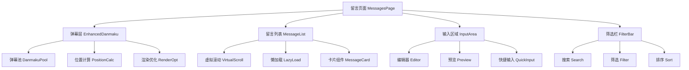

## 产品概述

逐步实施留言页面优化方案，提升页面性能和用户体验

## 核心功能

- 阶段一：性能优化（弹幕系统、虚拟滚动、懒加载）
- 阶段二：功能增强（编辑、回复、置顶、搜索）
- 阶段三：交互体验（弹幕交互、快捷键、实时通知）
- 阶段四：视觉设计（色彩、主题、响应式）
- 阶段五：高级功能（Markdown、数据分析）

## 技术栈

- 前端框架：React + TypeScript + Next.js
- 样式：Tailwind CSS
- 动画：Framer Motion
- 虚拟滚动：react-window
- 状态管理：React Hooks

## 实施策略

### 阶段划分

1. **第一阶段（性能优先）**：解决当前最影响用户体验的性能问题
2. **第二阶段（功能完善）**：添加用户急需的编辑、回复等功能
3. **第三阶段（体验提升）**：优化交互细节，提升操作便捷性
4. **第四阶段（视觉优化）**：改善视觉效果和响应式设计
5. **第五阶段（高级功能）**：根据需求选择性实施高级功能

## 关键技术决策

| 决策点 | 选择 | 理由 |
| --- | --- | --- |
| 虚拟滚动库 | react-window | 轻量、性能好、社区活跃 |
| 弹幕优化 | 对象池 + 批量处理 | 减少DOM操作，提升性能 |
| 懒加载 | Intersection Observer | 原生API，性能好 |
| 实时通知 | WebSocket | 标准实时通信方案 |

## 架构设计

## 性能优化点

1. **弹幕系统**：使用对象池复用DOM元素，减少创建销毁开销
2. **列表渲染**：虚拟滚动只渲染可视区域，支持大数据量
3. **图片加载**：Intersection Observer实现懒加载，减少初始请求
4. **动画优化**：减少非必要动画，支持 reduced-motion