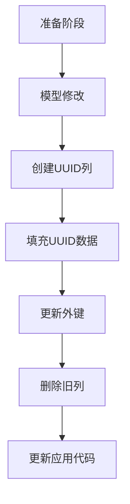
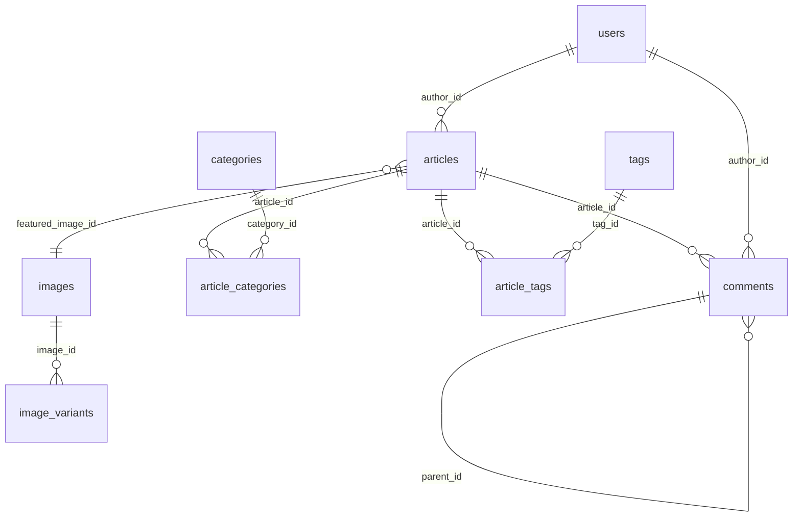

## 产品概述

将博客系统所有数据表的 ID 字段从 Integer 类型迁移到 UUID 类型，以提高数据唯一性和安全性。

## 核心功能

- 将所有表的主键从 Integer 类型迁移到 UUID 类型
- 更新所有外键引用为 UUID 类型
- 确保数据迁移过程中的数据完整性
- 提供可回滚的迁移方案

## 涉及的表

- users, articles, categories, tags, comments
- friend_links, images, image_variants, portfolio
- timeline_events, subscriptions, typewriter_contents
- article_categories, article_tags (关联表)

## 技术栈

- 数据库 ORM: SQLAlchemy 2.0
- 数据库: PostgreSQL
- 迁移工具: Alembic 1.13
- UUID 类型: sqlalchemy.UUID

## 架构设计

### 迁移策略

采用分阶段迁移策略，确保数据完整性和可回滚性：



### 表关系图



## 模块划分

- **模型层**: 修改所有 SQLAlchemy 模型的 ID 和外键类型
- **迁移层**: 创建 Alembic 迁移脚本处理数据库变更
- **业务逻辑层**: 更新 CRUD 操作以适配 UUID 类型

## 数据迁移流程

### 迁移步骤

1. **添加新 UUID 列**: 为每个表添加 id_uuid 列
2. **生成 UUID 数据**: 为现有记录生成 UUID 值
3. **更新外键引用**: 将所有外键引用从 Integer 改为 UUID
4. **切换主键**: 将主键从 id 切换到 id_uuid
5. **删除旧列**: 删除旧的 Integer 类型的 id 列

## 实现细节

### 核心目录结构

```
backend/
├── alembic/
│   └── versions/
│       └── 003_migrate_to_uuid.py  # 新建 UUID 迁移脚本
├── app/
│   ├── models/
│   │   ├── user.py                 # 修改: id 改为 UUID
│   │   ├── article.py              # 修改: id 和外键改为 UUID
│   │   ├── category.py             # 修改: id 改为 UUID
│   │   ├── tag.py                  # 修改: id 改为 UUID
│   │   ├── comment.py              # 修改: id 和外键改为 UUID
│   │   ├── image.py                # 修改: id 和外键改为 UUID
│   │   ├── friend_link.py          # 修改: id 改为 UUID
│   │   ├── portfolio.py            # 修改: id 改为 UUID
│   │   ├── timeline_event.py       # 修改: id 改为 UUID
│   │   ├── subscription.py        # 修改: id 改为 UUID
│   │   ├── typewriter_content.py   # 修改: id 改为 UUID
│   │   ├── article_category.py     # 修改: 复合主键改为 UUID
│   │   └── article_tag.py          # 修改: 复合主键改为 UUID
│   ├── schemas/
│   │   └── *.py                    # 更新: Schema 中的 id 类型改为 str
│   └── crud/
│       └── *.py                    # 更新: CRUD 操作适配 UUID 查询
```

### 关键代码结构

**UUID 类型导入**:

```python
from sqlalchemy import UUID
from sqlalchemy.dialects.postgresql import UUID as PG_UUID
```

**模型修改示例** (Article):

```python
# 修改前
id = Column(Integer, primary_key=True, index=True)
author_id = Column(Integer, ForeignKey("users.id"))

# 修改后
id = Column(UUID(as_uuid=True), primary_key=True, index=True, default=uuid.uuid4)
author_id = Column(UUID(as_uuid=True), ForeignKey("users.id"))
```

**迁移脚本关键逻辑**:

```python
def upgrade():
    # 1. 添加 id_uuid 列到所有表
    # 2. 使用 gen_random_uuid() 填充 UUID
    # 3. 更新所有外键约束
    # 4. 删除主键和外键约束
    # 5. 删除旧的 id 列
```

### 技术实现计划

**1. UUID 列生成策略**

- 使用 PostgreSQL 内置函数 `gen_random_uuid()` 生成 UUID
- 为现有数据批量填充 UUID 值
- 保持 UUID 的全局唯一性

**2. 外键约束处理**

- 先添加新的 UUID 外键列
- 填充对应的 UUID 引用
- 删除旧的 Integer 外键约束
- 创建新的 UUID 外键约束

**3. 主键切换**

- 先在 UUID 列上创建唯一索引
- 更新所有引用为 UUID
- 删除旧主键，设置 UUID 列为主键

**4. 数据验证**

- 迁移前后记录数验证
- 外键关系完整性验证
- 索引正确性验证

## 技术考虑

### 数据一致性

- 在单个事务中完成所有变更
- 使用 `step` 模式迁移，避免长时间锁表
- 提供完整的 downgrade 脚本

### 性能优化

- 批量操作减少数据库往返
- 在非高峰期执行迁移
- 对大表考虑分批处理

### 安全性

- UUID 的全局唯一性避免 ID 碰撞
- 不暴露序列式 ID，增强安全性
- 支持分布式部署

### 测试策略

- 在测试环境完整演练迁移
- 验证所有 CRUD 操作正常
- 测试 API 端点兼容性