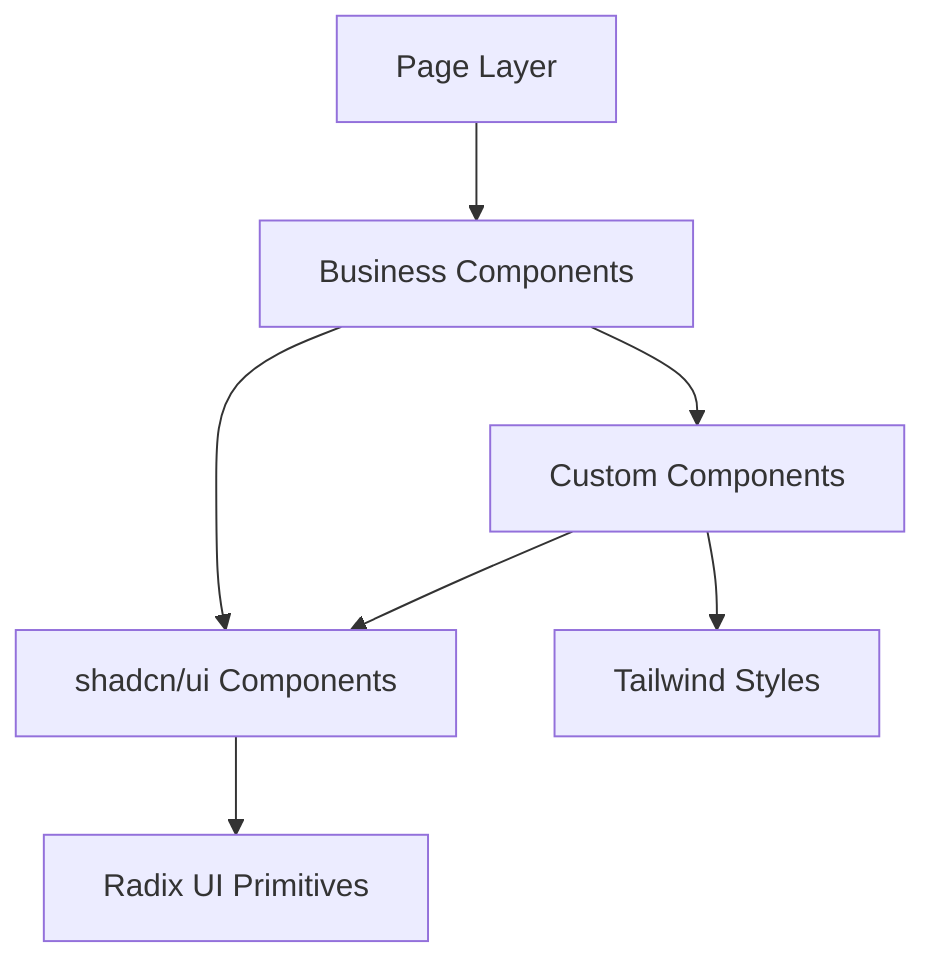

## 产品概述

集成shadcn/ui组件库到Next.js 14博客项目，采用玻璃拟态设计风格优化首页，实现高效复用组件和优雅的文件组织结构。

## 核心功能

- 集成shadcn/ui基础组件（Button、Card、Input、Tabs、NavigationMenu、Sheet、Tooltip、Separator、ScrollArea）
- 使用玻璃拟态设计风格优化博客首页，包含渐变背景、模糊效果、发光边框
- 重构现有组件，用shadcn的Card和Button替代自定义GlassCard，减少代码冗余
- 实现特色推荐、标签云、统计面板、时间轴、友情链接、作品集等6个新增组件
- 增强导航栏，支持移动端响应式布局和交互动画
- 统一样式管理，通过全局CSS类和Tailwind配置实现玻璃拟态效果

## 技术栈

- 前端框架：Next.js 14 + TypeScript + React
- 样式方案：Tailwind CSS
- UI组件库：shadcn/ui（基于Radix UI）
- 工具库：clsx、tailwind-merge、class-variance-authority
- 图标库：lucide-react

## 技术架构

### 系统架构

采用分层组件架构，将UI层分为基础组件层和业务组件层，实现高效的组件复用和维护。



### 模块划分

- **shadcn/ui基础组件层**：frontend/src/components/ui/ - 存放9个shadcn/ui基础组件（Button、Card、Input、Tabs等），提供可复用的UI原语
- **业务组件层**：frontend/src/components/home/ - 存放6个新业务组件（FeaturedSection、TagCloud、StatsPanel、Timeline、FriendLinks、Portfolio），基于shadcn组件构建
- **导航组件层**：frontend/src/components/navigation/ - Navbar和Footer，使用shadcn的NavigationMenu和Sheet增强
- **数据类型层**：frontend/src/types/ - 统一定义Post、Category、Portfolio、FriendLink等类型接口
- **工具函数层**：frontend/src/lib/ - utils.ts提供cn函数，组件内使用shadcn/ui的cva管理变体

### 数据流

页面请求数据 → React状态管理 → 业务组件渲染 → shadcn基础组件展示 → Tailwind样式应用 → 玻璃拟态视觉效果

## 实现细节

### 核心目录结构

```
frontend/src/
├── components/
│   ├── ui/                     # shadcn/ui基础组件（9个）
│   │   ├── button.tsx          # shadcn Button组件
│   │   ├── card.tsx            # shadcn Card组件
│   │   ├── input.tsx           # shadcn Input组件
│   │   ├── tabs.tsx            # shadcn Tabs组件
│   │   ├── navigation-menu.tsx # shadcn NavigationMenu组件
│   │   ├── sheet.tsx           # shadcn Sheet组件（移动端侧边栏）
│   │   ├── tooltip.tsx         # shadcn Tooltip组件
│   │   ├── separator.tsx       # shadcn Separator组件
│   │   └── scroll-area.tsx     # shadcn ScrollArea组件
│   ├── home/                   # 首页业务组件（复用现有+新增）
│   │   ├── HeroSection.tsx     # 使用shadcn Button
│   │   ├── PostGrid.tsx        # 使用shadcn Card替代GlassCard
│   │   ├── Sidebar.tsx         # 使用shadcn Card、Tabs、ScrollArea
│   │   ├── FeaturedSection.tsx # 使用shadcn Card
│   │   ├── TagCloud.tsx        # 使用shadcn Card、Tooltip
│   │   ├── StatsPanel.tsx      # 使用shadcn Card
│   │   ├── Timeline.tsx        # 使用shadcn Card、Separator
│   │   ├── FriendLinks.tsx     # 使用shadcn Card、Button
│   │   └── Portfolio.tsx       # 使用shadcn Card、Tabs
│   ├── navigation/
│   │   ├── Navbar.tsx          # 使用shadcn NavigationMenu、Sheet
│   │   └── Footer.tsx          # 使用shadcn Separator
│   └── blog/
│       └── PostCard.tsx        # 使用shadcn Card
├── types/
│   └── index.ts                # 统一导出所有类型接口
└── styles/
    └── globals.css             # 玻璃拟态样式类（保留现有.glass-card等）
```

### 关键代码结构

**类型定义**：集中管理跨组件复用的数据类型

```typescript
// types/index.ts
export interface Post {
  id: string;
  title: string;
  excerpt: string;
  date: string;
  readTime: string;
  category: string;
}

export interface Category {
  name: string;
  count: number;
}

export interface Tag {
  name: string;
  count: number;
}

export interface FriendLink {
  name: string;
  url: string;
  avatar?: string;
  description?: string;
}

export interface PortfolioItem {
  title: string;
  description: string;
  image: string;
  tags: string[];
  link?: string;
}

export interface TimelineItem {
  date: string;
  title: string;
  description: string;
}
```

**shadcn组件复用策略**：业务组件通过组合shadcn基础组件实现

```typescript
// home/PostGrid.tsx - 使用shadcn Card
import { Card, CardContent, CardFooter, CardHeader, CardTitle } from '@/components/ui/card';

// navigation/Navbar.tsx - 使用shadcn NavigationMenu和Sheet
import {
  NavigationMenu,
  NavigationMenuItem,
  NavigationMenuLink,
} from '@/components/ui/navigation-menu';
import { Sheet, SheetContent, SheetTrigger } from '@/components/ui/sheet';
```

**样式管理**：通过globals.css的.glass-card类和Tailwind的glass颜色主题实现玻璃拟态

```css
/* 保留现有玻璃拟态样式 */
.glass-card {
  background: rgba(15, 23, 42, 0.5);
  backdrop-filter: blur(16px);
  -webkit-backdrop-filter: blur(16px);
  border: 1px solid rgba(34, 211, 238, 0.15);
  box-shadow: 0 8px 32px rgba(0, 0, 0, 0.25);
  border-radius: 1rem;
  transition: all 0.3s cubic-bezier(0.4, 0, 0.2, 1);
}
```

### 技术实施计划

1. **shadcn/ui集成**：使用npx shadcn-ui@latest init初始化，安装所需的9个组件
2. **组件重构**：将现有的GlassCard替换为shadcn Card组件，更新PostCard、PostGrid、Sidebar等组件
3. **新增组件开发**：基于shadcn组件开发6个业务组件，每个组件复用合适的shadcn基础组件
4. **样式统一**：保留并优化globals.css中的玻璃拟态样式，确保与shadcn组件兼容
5. **移动端适配**：使用shadcn Sheet实现移动端侧边栏，NavigationMenu支持响应式导航

### 集成点

- shadcn组件通过`@/components/ui`路径导入
- 业务组件通过组合多个shadcn组件实现复杂UI
- 类型通过`@/types`统一导入
- 样式通过Tailwind类名和globals.css的.glass-*类组合使用

## 技术考量

### 性能优化

- 使用Next.js的动态导入（dynamic import）加载shadcn组件
- 优化玻璃拟态效果，使用transform和opacity代替backdrop-filter在低性能设备上
- 图片使用Next.js Image组件优化加载

### 安全措施

- shadcn/ui基于Radix UI，内置无障碍支持和安全处理
- 输入组件使用shadcn的Input组件，自带类型验证
- 外部链接使用target="_blank" rel="noopener noreferrer"

### 可扩展性

- 组件采用组合式设计，易于添加新变体
- 类型集中管理，便于扩展新的数据结构
- 样式通过Tailwind配置和CSS变量管理，支持主题切换

## 设计风格

采用赛博朋克玻璃拟态风格，结合深色科技背景和青色发光效果，创造极具视觉冲击力的现代博客界面。

## 设计内容描述

### 首页页面规划（单页面）

**顶部导航区块**：使用shadcn NavigationMenu实现桌面端导航，Glass卡片背景，青色发光边框，悬停时渐变下划线动画；移动端使用Sheet侧边栏，提供流畅的抽屉效果。

**英雄区块**：大标题使用文本渐变效果（青色到天蓝色渐变），副标题配简短描述；主要CTA按钮使用shadcn Button组件，带涟漪效果和发光边框；背景使用动态渐变动画。

**统计面板区块**：使用3个shadcn Card展示博客统计（文章数、访问量、分类数），每个卡片带玻璃背景和悬停浮动动画，数字使用发光效果。

**特色推荐区块**：使用shadcn Card展示3篇特色文章，卡片带玻璃背景，悬停时上浮和发光增强，图片使用圆角和渐变边框。

**文章列表区块**：左侧文章网格使用shadcn Card替代GlassCard，每个卡片包含封面图、标题、摘要、元信息；右侧边栏使用shadcn Card和Tabs组件，切换分类和热门文章，使用ScrollArea实现平滑滚动。

**标签云区块**：使用shadcn Card包裹，标签使用shadcn Button变体，带Tooltip显示文章数量，标签大小根据权重变化，悬停时发光效果。

**时间轴区块**：使用shadcn Card和Separator组件，时间点带发光圆点，连接线使用渐变动画，内容卡片带玻璃背景。

**友情链接和作品集区块**：双列布局，左侧友情链接使用shadcn Card，每个链接带头像和悬停特效；右侧作品集使用shadcn Tabs切换项目类型，卡片带玻璃背景和悬停放大效果。

**订阅区块**：使用shadcn Card包裹，Email输入框使用shadcn Input组件，带聚焦发光边框，订阅按钮使用shadcn Button带涟漪效果。

## Agent Extensions

### SubAgent

- **code-explorer**
- Purpose: 搜索并分析项目中所有需要重构的组件文件，识别使用GlassCard和其他自定义组件的位置
- Expected outcome: 生成需要重构的组件清单，明确每个组件需要替换的shadcn组件类型