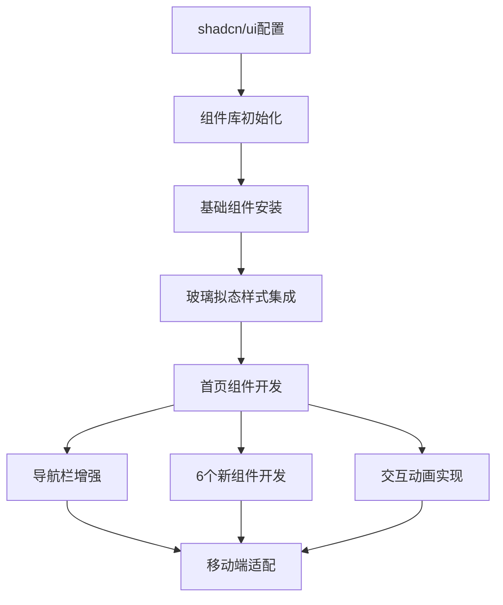

## Product Overview

将shadcn/ui组件库集成到现有Next.js 14博客项目中，采用玻璃拟态设计风格，优化博客首页的UI/UX体验，提供现代化的视觉效果和流畅的交互体验。

## Core Features

- 集成shadcn/ui基础组件库，配置components.json和相关依赖
- 创建玻璃拟态风格的导航栏，集成Sheet组件实现移动端响应式菜单
- 开发特色推荐展示区域，展示精选文章和重要内容
- 构建动态标签云组件，提供文章分类快速导航
- 设计统计面板，展示博客关键指标数据
- 实现时间轴组件，展示创作历程和重要事件
- 创建友情链接展示区域，支持外部资源推荐
- 开发作品集展示组件，呈现个人项目和作品
- 添加交互反馈动画，包括悬停效果、过渡动画和微交互
- 实现轻度磨砂玻璃效果，保持内容可读性的同时增强视觉层次
- 完成移动端响应式适配，确保多设备良好体验

## Tech Stack

- 前端框架: Next.js 14 (App Router)
- UI组件库: shadcn/ui
- 样式方案: Tailwind CSS + 自定义CSS变量
- 编程语言: TypeScript
- 工具库: class-variance-authority, clsx, tailwind-merge

## Tech Architecture

### System Architecture



### Module Division

- **UI基础组件模块**: 封装shadcn/ui基础组件（Button, Card, Input, Tabs等）
- **样式系统模块**: 玻璃拟态主题、动画系统、响应式断点
- **导航模块**: 桌面端导航栏 + 移动端Sheet侧边栏
- **内容展示模块**: 特色推荐、标签云、统计面板、时间轴、友情链接、作品集
- **交互模块**: 悬停效果、点击反馈、过渡动画

### Data Flow

用户交互 → shadcn组件事件处理 → 状态更新 → 样式类应用 → 视觉反馈动画

## Implementation Details

### Core Directory Structure

```
frontend/
├── src/
│   ├── components/
│   │   ├── ui/                    # shadcn/ui组件目录
│   │   │   ├── button.tsx        # Button组件
│   │   │   ├── card.tsx          # Card组件
│   │   │   ├── input.tsx         # Input组件
│   │   │   ├── tabs.tsx          # Tabs组件
│   │   │   ├── navigation-menu.tsx # NavigationMenu组件
│   │   │   ├── sheet.tsx         # Sheet组件（移动端菜单）
│   │   │   ├── tooltip.tsx       # Tooltip组件
│   │   │   ├── separator.tsx     # Separator组件
│   │   │   └── scroll-area.tsx   # ScrollArea组件
│   │   ├── navigation/
│   │   │   └── Navbar.tsx         # 增强的玻璃拟态导航栏
│   │   └── home/
│   │       ├── FeaturedSection.tsx # 特色推荐组件
│   │       ├── TagCloud.tsx      # 标签云组件
│   │       ├── StatsPanel.tsx    # 统计面板组件
│   │       ├── Timeline.tsx       # 时间轴组件
│   │       ├── FriendLinks.tsx   # 友情链接组件
│   │       └── Portfolio.tsx     # 作品集组件
│   ├── lib/
│   │   └── utils.ts              # cn工具函数（已有）
│   ├── styles/
│   │   └── globals.css           # 全局样式和玻璃拟态CSS（已有）
│   └── components.json           # shadcn/ui配置文件（新增）
```

### Key Code Structures

**components.json配置文件**: 定义shadcn/ui的基础配置

```
{
  "$schema": "https://ui.shadcn.com/schema.json",
  "style": "new-york",
  "rsc": true,
  "tsx": true,
  "tailwind": {
    "config": "tailwind.config.js",
    "css": "src/styles/globals.css",
    "baseColor": "slate",
    "cssVariables": true,
    "prefix": ""
  },
  "aliases": {
    "components": "@/components",
    "utils": "@/lib/utils",
    "ui": "@/components/ui",
    "lib": "@/lib",
    "hooks": "@/hooks"
  }
}
```

**玻璃拟态样式应用**: 在现有globals.css基础上集成

```css
.glass-morphism {
  background: rgba(15, 23, 42, 0.6);
  backdrop-filter: blur(16px);
  -webkit-backdrop-filter: blur(16px);
  border: 1px solid rgba(34, 211, 238, 0.2);
}
```

### Technical Implementation Plan

1. **shadcn/ui集成初始化**

- 创建components.json配置文件
- 安装所需依赖包
- 配置Tailwind CSS插件

2. **核心组件安装与配置**

- 使用CLI安装9个基础组件
- 配置组件样式变体
- 集成玻璃拟态主题

3. **导航栏增强**

- 使用GlassCard和shadcn组件重构Navbar
- 集成Sheet组件实现移动端侧边栏
- 添加NavigationMenu支持下拉菜单

4. **新组件开发**

- 特色推荐展示区域（Card组件）
- 标签云组件（Button、Badge）
- 统计面板组件（Card）
- 时间轴组件（Separator、Card）
- 友情链接组件（Card、Tooltip）
- 作品集组件（Card、Tabs）

5. **交互动画实现**

- 悬停效果（hover states）
- 过渡动画（transitions）
- 按钮涟漪效果（ripple）

6. **响应式布局适配**

- 移动端菜单优化
- 组件断点适配
- 触摸交互优化

### Integration Points

- shadcn/ui组件与现有GlassCard组件的样式统一
- Tailwind CSS配置文件扩展，添加shadcn插件
- 全局CSS变量与shadcn主题系统整合
- 移动端Sheet与桌面端导航的状态共享

## Technical Considerations

- **样式兼容性**: 保持现有玻璃拟态样式，shadcn组件通过自定义CSS变量适配
- **性能优化**: 使用CSS动画而非JavaScript动画，避免重绘
- **可访问性**: shadcn组件自带ARIA支持，保持键盘导航和屏幕阅读器兼容
- **类型安全**: 所有shadcn组件使用TypeScript，确保类型检查

## Tech Documentation Guidelines

- 所有shadcn组件安装通过CLI命令执行
- 自定义组件遵循shadcn的设计规范
- 玻璃拟态效果通过CSS类名复用，避免重复代码
- 响应式断点使用Tailwind默认值（sm、md、lg、xl）

## Design Style

采用现代玻璃拟态设计风格，结合shadcn/ui组件库的简洁美学，打造具有科技感和视觉层次的博客首页。整体色调以深蓝背景为主，搭配青色/天蓝色渐变点缀，营造高端专业的视觉体验。

## Page Planning

### 首页布局结构

**顶部导航栏**: 玻璃拟态效果，固定在顶部，包含Logo、导航链接、移动端菜单按钮
**Hero区域**: 全屏宽幅，展示核心标语和CTA按钮，渐变背景动画
**统计面板**: 4个数据卡片展示博客关键指标
**特色推荐**: 3-4篇精选文章卡片，使用网格布局
**文章列表**: 左右分栏，左侧文章网格，右侧边栏
**标签云**: 展示文章分类标签，大小不一形成视觉层次
**时间轴**: 垂直时间线展示创作历程
**友情链接与作品集**: 双栏布局，玻璃拟态卡片展示

### 单页面块设计

**导航栏块**:

- Logo居左，导航链接居中，搜索和菜单按钮居右
- 玻璃拟态背景，底部渐变边框
- 悬停时链接下划线动画，移动端展开Sheet侧边栏

**Hero区块**:

- 全屏高度，渐变动态背景
- 居中大标题，渐变文字效果
- 主按钮（玻璃拟态）和次按钮（描边风格）
- 浮动装饰元素增强视觉

**统计面板区块**:

- 横向排列4个数据卡片
- 每个卡片包含图标、数值、标签
- 悬停时卡片上浮和发光效果
- 响应式布局移动端换行

**特色推荐区块**:

- 标题横幅，渐变下划线
- 3列网格布局文章卡片
- 卡片包含封面图、标题、摘要、元数据
- 悬停时卡片缩放和阴影增强

**文章列表区块**:

- 左侧主区域PostGrid，3列网格
- 右侧Sidebar包含分类和热门文章
- 使用Card组件包裹各部分内容
- 滚动区域使用ScrollArea组件

**标签云区块**:

- 云状布局，标签大小根据权重变化
- 悬停时标签颜色变化和缩放
- 按钮组件实现，支持点击筛选

**时间轴区块**:

- 垂直时间线，节点连接线
- 左右交替布局内容卡片
- 使用Separator组件分隔节点
- 卡片淡入动画

**友情链接与作品集区块**:

- 双栏布局，各占50%
- 友情链接使用Tooltip显示描述
- 作品集使用Tabs切换分类
- 卡片悬停效果和图标动画