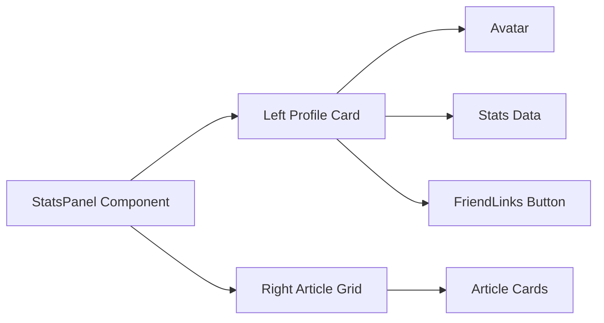

## Product Overview

重新设计StatsPanel组件为左侧个人信息卡片、右侧文章卡片的布局，包含圆形头像、统计数据和友站按钮。

## Core Features

- **左侧个人信息卡片**：圆形卡通头像、网站名称"POETIZE"、文章数量105、分类数量6、访问量251383、友站按钮
- **右侧文章卡片列表**：显示文章卡片，类似现有的PostGrid组件
- **浅蓝色背景**：使用tech-lightcyan颜色作为背景
- **响应式布局**：在移动端垂直排列，桌面端左右分栏
- **动画效果**：保持原有的数字滚动动画和过渡效果
- **主题一致性**：与现有设计风格保持一致

## Tech Stack

- Frontend framework: React + TypeScript
- Styling: Tailwind CSS
- Component library: Shadcn/ui
- Animation: Custom CSS animations and transitions

## Tech Architecture

### System Architecture



### Module Division

- **ProfileCard Module**: 左侧个人信息卡片组件，包含头像、统计数据和友站按钮
- **ArticleGrid Module**: 右侧文章列表组件，复用现有的PostGrid
- **StatsAnimation Module**: 数字滚动动画逻辑（复用现有useNumberAnimation）

### Data Flow

用户访问页面 → StatsPanel渲染 → 左侧个人信息卡片显示 → 右侧文章列表加载 → 数字动画效果触发

## Implementation Details

### Core Directory Structure

```
project-root/
├── frontend/src/
│   ├── components/home/
│   │   ├── StatsPanel.tsx          # 重构后的主组件
│   │   ├── ProfileCard.tsx         # 新增：个人信息卡片组件
│   │   └── FriendLinksButton.tsx   # 新增：友站按钮组件
│   ├── styles/
│   │   └── globals.css            # 更新颜色变量
```

### Key Code Structures

**ProfileCard Interface**: 定义个人信息卡片的数据结构

```typescript
interface ProfileData {
  name: string;
  avatarUrl: string;
  postCount: number;
  categoryCount: number;
  viewCount: number;
  friendLinkUrl: string;
}
```

**StatsPanel Component**: 重构后的主组件结构

```typescript
export default function StatsPanel() {
  const { resolvedTheme } = useTheme();
  const profileData: ProfileData = {
    name: 'POETIZE',
    avatarUrl: '/images/avatar.png',
    postCount: 105,
    categoryCount: 6,
    viewCount: 251383,
    friendLinkUrl: '/friend-links'
  };

  const articles = useMockPosts(); // 复用现有的文章数据

  return (
    <div className="grid grid-cols-1 lg:grid-cols-2 gap-8">
      {/* 左侧个人信息卡片 */}
      <ProfileCard data={profileData} />
      
      {/* 右侧文章列表 */}
      <div className="bg-tech-lightcyan rounded-2xl p-6 shadow-lg">
        <PostGrid posts={articles} />
      </div>
    </div>
  );
}
```

## Design Style

采用现代科技感设计风格，使用渐变蓝色调，玻璃态效果和微妙的阴影，营造专业而清新的视觉效果。

### 页面规划

1. **StatsPanel主页面**：左右分栏布局
2. **ProfileCard组件**：个人信息卡片，包含圆形头像、统计数据和友站按钮
3. **ArticleGrid组件**：文章卡片列表，保持现有设计

## 设计细节

- 左侧卡片使用浅蓝色背景，带有轻微的玻璃态效果
- 圆形头像使用卡通风格，带有悬停缩放效果
- 统计数据使用数字动画效果
- 友站按钮使用渐变蓝色，带有悬停效果
- 右侧文章卡片保持现有的卡片样式
- 响应式设计，移动端自动堆叠

## Agent Extensions

### SubAgent

- **code-explorer**
- Purpose: 搜索和探索代码结构，确保组件重构符合现有架构
- Expected outcome: 获取完整的组件依赖关系和现有代码模式