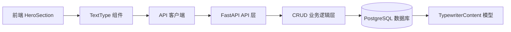

## 产品概述

设计并实现打字机内容管理系统，包括后端数据库模型、API 接口和前端集成，实现打字机内容的动态获取和存储，替换前端 TextType 组件的硬编码文本。

## 核心功能

- 创建打字机内容数据模型，支持多个文本内容配置
- 提供 RESTful API 接口，支持打字机内容的增删改查
- 实现前端 API 客户端，动态获取打字机文本数据
- 修改 TextType 组件，支持从后端 API 获取文本内容
- 支持打字机内容的优先级和显示状态管理

## 技术栈

- 后端：FastAPI + SQLAlchemy + PostgreSQL + Alembic
- 前端：Next.js 14 + TypeScript + Tailwind CSS + GSAP
- 数据持久化：PostgreSQL 数据库

## 技术架构

### 系统架构

- 架构模式：三层架构（API 层、业务逻辑层、数据层）
- 遵循现有项目的 FastAPI + SQLAlchemy 分层结构



### 模块划分

- **后端模型层**：TypewriterContent 数据模型，定义数据库表结构
- **后端数据验证层**：Pydantic schemas，定义请求和响应数据结构
- **后端业务逻辑层**：CRUD 操作，封装数据库访问逻辑
- **后端 API 层**：FastAPI 路由，提供 RESTful 接口
- **前端 API 客户端**：封装 API 调用逻辑
- **前端组件层**：修改 TextType 组件，集成动态数据获取

### 数据流

用户访问页面 → HeroSection 组件加载 → TextType 组件初始化 → 调用 API 客户端获取数据 → FastAPI 处理请求 → CRUD 查询数据库 → 返回打字机内容 → TextType 渲染动画

## 实现细节

### 核心目录结构

```
backend/
├── app/
│   ├── models/
│   │   └── typewriter_content.py          # 新增：打字机内容模型
│   ├── schemas/
│   │   └── typewriter_content.py          # 新增：数据验证 schemas
│   ├── crud/
│   │   └── typewriter_content.py         # 新增：CRUD 操作
│   ├── api/
│   │   └── v1/
│   │       ├── endpoints/
│   │       │   └── typewriter_contents.py # 新增：API 路由
│   │       └── router.py                  # 修改：注册新路由
│   └── __init__.py                        # 修改：导出新模型

frontend/
├── src/
│   ├── lib/
│   │   └── api.ts                         # 新增：API 客户端封装
│   └── components/
│       └── home/
│           ├── HeroSection.tsx            # 修改：集成动态数据
│           └── TextType.tsx               # 修改：支持动态文本
```

### 关键代码结构

**TypewriterContent 模型**：定义打字机内容的数据库表结构，包含文本内容、优先级、显示状态等字段。

```python
# 数据模型定义
class TypewriterContent(Base):
    __tablename__ = "typewriter_contents"
    
    id = Column(Integer, primary_key=True, index=True)
    text = Column(String(500), nullable=False)
    priority = Column(Integer, default=0)
    is_active = Column(Boolean, default=True)
    created_at = Column(DateTime(timezone=True), server_default=func.now())
    updated_at = Column(DateTime(timezone=True), onupdate=func.now())
```

**TypewriterContent Schema**：Pydantic 数据验证模型，定义创建、更新和响应的数据结构。

```python
# 数据验证模型
class TypewriterContentCreate(BaseModel):
    text: str
    priority: int = 0
    is_active: bool = True

class TypewriterContentUpdate(BaseModel):
    text: Optional[str] = None
    priority: Optional[int] = None
    is_active: Optional[bool] = None
```

**CRUD 操作函数**：数据库操作的封装层，提供增删改查等基础操作。

```python
# CRUD 操作
def get_active_contents(db: Session) -> List[TypewriterContent]:
    return db.query(TypewriterContent).filter(
        TypewriterContent.is_active == True
    ).order_by(TypewriterContent.priority.asc()).all()
```

**API 端点**：FastAPI 路由定义，提供 RESTful 接口。

```python
# API 路由
@router.get("/active", response_model=List[TypewriterContent])
def get_active_typewriter_contents(db: Session = Depends(get_db)):
    return crud.get_active_contents(db)
```

**前端 API 客户端**：封装 HTTP 请求逻辑。

```typescript
// API 客户端
export async function getTypewriterContents(): Promise<string[]> {
  const response = await fetch('/api/v1/typewriter-contents/active');
  const data = await response.json();
  return data.map((item: TypewriterContent) => item.text);
}
```

### 技术实现计划

1. **后端数据库模型创建**

- 问题：需要创建新的数据表来存储打字机内容
- 方案：创建 TypewriterContent 模型，包含文本、优先级、状态等字段
- 技术栈：SQLAlchemy ORM + PostgreSQL
- 实现步骤：

    1. 定义 TypewriterContent 模型类
    2. 创建 Alembic 迁移脚本
    3. 执行数据库迁移

2. **后端 API 接口开发**

- 问题：需要提供打字机内容的增删改查接口
- 方案：遵循现有项目架构，创建 schemas、crud 和 endpoints
- 技术栈：FastAPI + Pydantic
- 实现步骤：

    1. 创建 Pydantic schemas（Create、Update、Response）
    2. 实现 CRUD 操作函数
    3. 创建 FastAPI 路由并注册到 API Router
    4. 添加数据验证和错误处理

3. **前端 API 集成**

- 问题：前端需要调用后端接口获取数据
- 方案：创建 API 客户端封装，使用 fetch API
- 技术栈：Next.js + TypeScript + fetch
- 实现步骤：

    1. 创建 API 客户端函数
    2. 添加 TypeScript 类型定义
    3. 处理错误状态和加载状态

4. **TextType 组件改造**

- 问题：将硬编码文本改为动态获取
- 方案：添加可选的异步数据获取功能
- 技术栈：React Hooks + GSAP
- 实现步骤：

    1. 修改 TextType 组件，支持异步文本加载
    2. 添加加载状态处理
    3. 保持向后兼容，支持静态文本传入
    4. 更新 HeroSection 组件使用新功能

5. **测试策略**

- 后端：使用 pytest 进行单元测试和集成测试
- 前端：手动测试打字机效果和数据加载
- API：使用 FastAPI 自动文档和 Postman 测试

### 集成点

- 后端 API 注册到 `app/api/v1/router.py`
- 前端 API 客户端放置在 `src/lib/api.ts`
- TextType 组件保持向后兼容，支持静态文本和动态数据两种模式
- 数据库迁移通过 Alembic 管理

## 技术考虑

### 日志

- 遵循后端现有的日志配置，记录 API 请求和错误信息

### 性能优化

- 后端：为常用查询字段添加数据库索引
- 前端：使用 React 的 useEffect 和 useState 优化数据加载
- 考虑添加 API 响应缓存机制（可选）

### 安全措施

- API 接口根据需要添加认证和授权
- 输入数据通过 Pydantic schemas 验证
- 防止 SQL 注入（使用 SQLAlchemy ORM 自动处理）

### 可扩展性

- 模型设计支持扩展更多打字机配置参数
- API 设计遵循 RESTful 规范，便于后续扩展
- 组件设计保持灵活性，支持多种数据来源