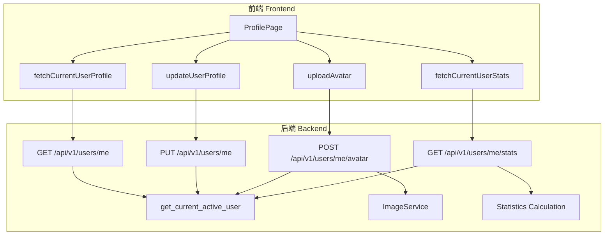

## 产品概述

分析个人简介页面的后端接口接入情况，补充缺失的后端接口以支持完整的用户资料管理功能。

## 核心功能

- 获取当前登录用户的个人资料
- 更新当前登录用户的个人资料（头像、简介、社交链接等）
- 上传用户头像
- 获取用户统计数据（文章数、评论数、加入日期等）

## 技术栈

- 后端框架：FastAPI + Python 3.x
- 数据库：SQLAlchemy ORM
- 认证：OAuth2PasswordBearer + JWT
- 前端：React + TypeScript
- 图片处理：Pillow (通过 ImageService)

## 实现方案

采用RESTful API设计，在现有用户端点基础上添加/me子资源接口，用于当前登录用户的自我操作。使用get_current_active_user依赖注入确保只有认证用户才能访问这些接口。

### 系统架构



### 接口设计

1. **GET /api/v1/users/me** - 获取当前用户资料

- 认证：需要Bearer token
- 返回：完整的用户信息（UserProfile schema）

2. **PUT /api/v1/users/me** - 更新当前用户资料

- 认证：需要Bearer token
- 请求体：UserUpdate schema（允许部分更新）
- 返回：更新后的用户信息

3. **POST /api/v1/users/me/avatar** - 上传头像

- 认证：需要Bearer token
- 请求体：multipart/form-data (file字段)
- 返回：{ avatar_url: string }
- 处理：使用ImageService保存图片并返回URL

4. **GET /api/v1/users/me/stats** - 获取用户统计

- 认证：需要Bearer token
- 返回：{ article_count, comment_count, joined_date, total_views }
- 计算：从Article和Comment表统计当前用户的数据

## 实现细节

### 目录结构

```
backend/
├── app/
│   ├── api/v1/endpoints/
│   │   └── users.py                # [MODIFY] 添加/me相关端点
│   ├── schemas/
│   │   └── user.py                 # [MODIFY] 添加UserStats和AvatarResponse schema
│   ├── crud/
│   │   └── user.py                 # [MODIFY] 添加获取用户统计的CRUD函数
│   └── core/
│       └── dependencies.py         # [READ] 使用现有的get_current_active_user依赖

frontend/
├── src/
│   ├── lib/api/
│   │   └── profile.ts              # [READ] 现有API函数，确认数据结构
│   ├── app/profile/
│   │   └── page.tsx                # [MODIFY] 替换模拟数据为实际API调用
```

### 关键代码结构

**UserStats Schema** (backend/app/schemas/user.py):

```python
class UserStats(BaseModel):
    article_count: int = Field(..., description="用户发布的文章数量")
    comment_count: int = Field(..., description="用户发表的评论数量")
    joined_date: str = Field(..., description="用户加入日期")
    total_views: int = Field(default=0, description="用户文章总浏览量")
```

**AvatarResponse Schema** (backend/app/schemas/user.py):

```python
class AvatarResponse(BaseModel):
    avatar_url: str = Field(..., description="头像URL")
    message: str = Field(default="Avatar uploaded successfully")
```

## 性能与可靠性

- 统计数据查询使用SQLAlchemy聚合函数，避免N+1查询
- 头像上传使用异步处理和文件清理机制
- 所有/me端点使用统一的认证依赖，确保安全性
- 使用事务保证数据一致性

## 架构扩展性

- 未来可轻松扩展新的用户统计指标
- 头像上传接口可支持更多图片处理选项（如裁剪、水印）
- 统计接口可添加缓存机制提升性能