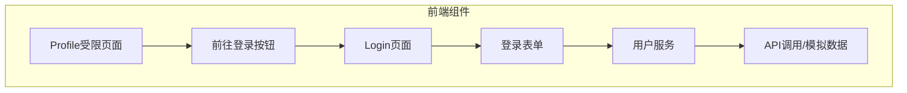

## 产品概述

为个人简介页面的访问受限状态添加前往登录页面的按钮，并创建一个完整的登录页面，使用 shadcn/ui 组件库，遵循现有项目的设计风格。

## 核心功能

- 创建登录页面，包含用户名和密码输入表单
- 更新访问受限页面的按钮，添加路由跳转功能
- 实现登录表单的验证和错误处理
- 使用 GlassCard 和 Button(glass variant) 组件保持设计一致性
- 集成现有的用户服务进行登录逻辑

## 技术栈

- 前端框架：Next.js 14+ (App Router)
- 组件库：shadcn/ui (Radix UI + Tailwind CSS)
- 状态管理：React Hooks (useState, useEffect)
- 路由：Next.js useRouter
- 设计风格：Glass morphism + 科技主题配色

## 实现方案

在现有项目架构基础上，创建登录页面并更新访问受限页面的导航按钮。

### 系统架构



### 接口设计

登录页面将使用现有的 `userService.loginUser()` 函数：

- 输入：{ email: string, password: string }
- 输出：{ success: boolean, user?: UserProfile, error?: string }

## 实现细节

### 目录结构

```
frontend/
├── src/
│   ├── app/
│   │   ├── login/
│   │   │   └── page.tsx                # [NEW] 登录页面
│   │   └── profile/
│   │       └── page.tsx                # [MODIFY] 更新受限页面按钮
│   └── services/
│       └── userService.ts               # [READ] 使用现有的 loginUser 函数
```

### 关键代码结构

**Login 页面核心结构** (frontend/src/app/login/page.tsx):

```typescript
'use client';

import { useState } from 'react';
import { useRouter } from 'next/navigation';
import { Lock, Mail } from 'lucide-react';
import GlassCard from '@/components/ui/GlassCard';
import { Button } from '@/components/ui/Button';
import { Input } from '@/components/ui/input';
import { Label } from '@/components/ui/label';
import { loginUser } from '@/services/userService';

export default function LoginPage() {
  const [email, setEmail] = useState('');
  const [password, setPassword] = useState('');
  const [loading, setLoading] = useState(false);
  const [error, setError] = useState('');
  const router = useRouter();

  // 表单提交逻辑
  // 错误处理
  // 成功后跳转到 /profile
}
```

**Profile 页面按钮更新** (frontend/src/app/profile/page.tsx 第100行):

```typescript
import Link from 'next/link';
import { Button } from '@/components/ui/Button';

// 替换原有的 button 元素
<Button
  asChild
  variant="glass"
  className="hover:scale-105"
>
  <Link href="/login">前往登录</Link>
</Button>
```

## 设计规范

### 样式要点

- 使用 GlassCard 组件作为登录表单容器，设置 padding="lg"
- Button 使用 variant="glass" 配合 hover:scale-105 动画效果
- Input 使用现有的样式类（bg-glass border-glass-border backdrop-blur-lg）
- 添加图标（Mail 和 Lock）增强视觉效果
- 错误消息使用红色边框的 GlassCard 或红色文本提示
- Loading 状态显示加载动画

### 响应式设计

- 登录表单在移动端使用 max-w-md w-full mx-4
- 桌面端居中显示
- 输入框在所有屏幕尺寸下保持良好的点击区域

### 主题适配

- 所有组件使用项目现有的 CSS 变量（--tech-cyan, --glass, --glass-border）
- 自动适配亮色/暗色主题
- 玻璃效果在暗色主题下更加明显

## 性能与可靠性

- 表单提交时禁用按钮防止重复提交
- 错误消息清晰明确，提供用户反馈
- 成功登录后立即跳转到 profile 页面
- 使用 localStorage 存储用户状态（已有实现）

## 设计风格

采用项目现有的 Glass morphism 设计风格，融合科技主题配色方案。登录页面需要与个人资料页面保持视觉一致性，营造现代、专业的用户体验。

### 页面布局

- 使用居中的 GlassCard 作为主容器
- 标题区：大型欢迎文字 + 装饰性图标
- 表单区：邮箱和密码输入框，带图标装饰
- 操作区：登录按钮 + 注册链接（可选）
- 底部区：版权信息或装饰元素

### 视觉元素

- 输入框左侧添加图标（Mail 和 Lock）增强可识别性
- 背景添加微妙的渐变或波纹效果（如项目已实现）
- 按钮使用 glass variant 配合 hover:scale-105 动画
- 错误状态使用红色边框或文字提示
- Loading 状态显示旋转加载动画

### 交互反馈

- 输入框 focus 状态显示 tech-cyan 边框（现有样式）
- 按钮 hover 状态放大 1.05 倍并增强阴影
- 点击按钮时显示涟漪效果（Button 组件已实现）
- 表单提交期间显示加载状态并禁用按钮
- 错误消息淡入显示，3秒后自动消失