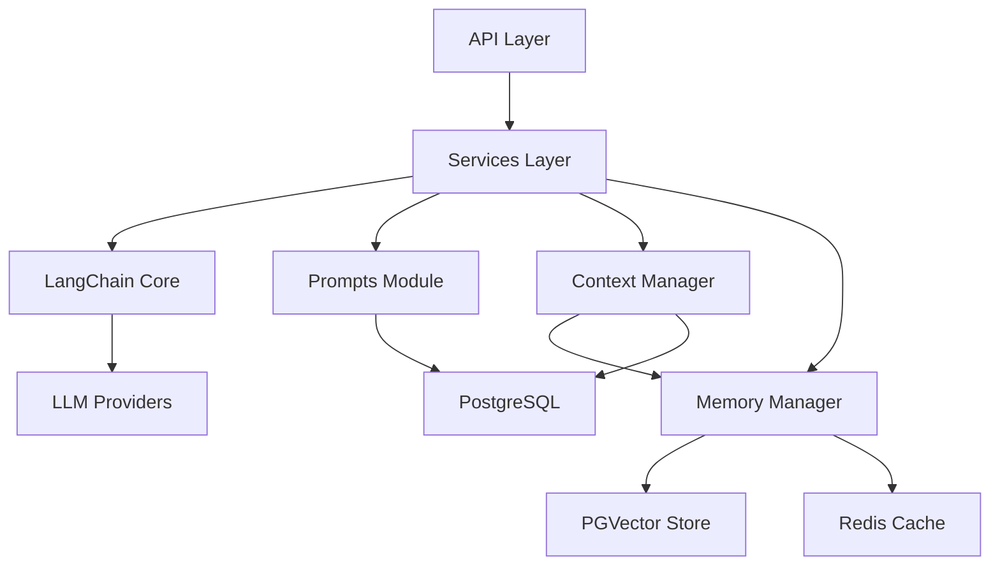

## 产品概述

基于 LangChain 框架构建企业级 LLM 对话系统，在现有博客平台基础上集成多轮对话、提示词工程、上下文管理和记忆管理功能。支持多租户数据隔离，满足 1000+ 并发用户需求。

## 核心功能

- **Prompt 管理**：标准化模板系统、版本控制、A/B 测试、效果追踪、多语言支持
- **上下文管理**：对话历史存储与检索、智能窗口管理、自动摘要、关键信息提取、相关性评分
- **记忆管理**：短期/长期记忆分层、用户偏好学习、向量存储（PGVector）、记忆过期机制
- **对话引擎**：多轮对话支持、上下文连贯性、模型热切换、灰度发布
- **企业级功能**：多租户数据隔离、权限管理、API 限流、对话审计、监控告警
- **性能指标**：单轮响应 < 500ms、代码覆盖率 >= 80%、异步高并发支持

## 技术栈选择

- **核心框架**：FastAPI 0.115.6 + Python 3.10+
- **LangChain 集成**：langchain>=0.1.0, langchain-community>=0.0.20, langchain-postgres>=0.0.10
- **向量数据库**：PostgreSQL + pgvector 扩展
- **数据库 ORM**：SQLAlchemy 2.0.23（现有）
- **缓存层**：Redis 5.0.1（现有）
- **认证安全**：JWT + python-jose（现有）
- **日志监控**：loguru 0.7.2（现有）
- **异步支持**：asyncio + httpx 0.27.0
- **测试框架**：pytest + pytest-asyncio

## 实现方法

采用完全迁移策略，将现有自定义 LLM 提供商系统完全替换为 LangChain 架构。通过 LangChain 的 BaseChatModel 统一抽象，利用其 Chains、Prompts、Memory 组件构建模块化系统。使用 PGVector 作为向量存储，实现多租户数据隔离。

关键决策：

1. **LLM 迁移**：创建 LangChain 兼容的 ChatModel 适配器，替换现有 LLMProvider 抽象
2. **多租户架构**：数据库层面使用 tenant_id 字段隔离，中间件自动注入租户上下文
3. **记忆存储**：PGVector 用于长期记忆向量检索，Redis 用于短期记忆缓存
4. **Prompt 版本管理**：数据库存储多版本模板，支持 A/B 测试分配

性能优化：异步数据库操作、连接池复用、向量检索缓存、Prompt 模板缓存。

## 实现注意事项

- **向后兼容**：保留现有 API 端点，通过适配层平滑迁移
- **性能**：向量检索使用异步 pgvector，避免 N+1 查询，使用 Redis 缓存热点数据
- **日志**：复用 app_logger，记录 LLM 调用、对话状态、性能指标，避免记录敏感信息
- **爆炸范围控制**：渐进式迁移，先新增模块再替换旧模块，使用 feature flag 控制新功能

## 架构设计

### 系统架构

采用分层架构：

- **API 层**：FastAPI 路由，认证、限流、审计
- **服务层**：业务逻辑封装，对话引擎、记忆管理、Prompt 服务
- **LangChain 层**：链式调用、Prompt 模板、Memory 组件
- **数据层**：SQLAlchemy ORM + PGVector + Redis

### 模块关系



### 数据流

用户请求 -> API 层（认证/限流）-> 服务层（获取 Prompt/记忆/上下文）-> LangChain 链（构建完整输入）-> LLM 调用 -> 响应返回 -> 更新记忆/上下文 -> 记录审计日志

## 目录结构

```
backend/app/
├── api/v1/endpoints/
│   ├── llm.py                    # [MODIFY] 重构为 LangChain 对话接口
│   ├── prompts.py                # [NEW] Prompt 管理接口（CRUD、版本、A/B 测试）
│   ├── conversations.py          # [NEW] 对话管理接口（创建、查询、删除）
│   ├── memories.py               # [NEW] 记忆管理接口（增删改查、检索）
│   └── tenants.py                # [NEW] 租户管理接口
├── core/
│   ├── langchain/                # [NEW] LangChain 核心模块
│   │   ├── __init__.py
│   │   ├── llm_adapter.py        # LangChain LLM 适配器（包装现有提供商）
│   │   ├── chains.py             # LangChain 链定义（对话链、RAG 链）
│   │   └── prompts.py            # LangChain Prompt 模板集成
│   ├── database.py               # [MODIFY] 添加 PGVector 支持
│   ├── security.py               # [MODIFY] 添加租户上下文管理
│   └── config.py                 # [MODIFY] 添加 LangChain 配置
├── models/
│   ├── user.py                   # [MODIFY] 添加 tenant_id 外键
│   ├── prompt.py                 # [NEW] Prompt 模型（多版本、A/B 测试）
│   ├── conversation.py           # [NEW] 对话模型（多轮消息、上下文）
│   ├── memory.py                 # [NEW] 记忆模型（向量存储）
│   ├── context_history.py        # [NEW] 上下文历史模型
│   └── tenant.py                 # [NEW] 租户模型
├── schemas/
│   ├── llm.py                    # [MODIFY] 扩展对话请求/响应 Schema
│   ├── prompt.py                 # [NEW] Prompt Schema
│   ├── conversation.py           # [NEW] 对话 Schema
│   └── memory.py                 # [NEW] 记忆 Schema
├── services/
│   ├── llm_service.py            # [MODIFY] 重构为 LangChain 对话引擎
│   ├── prompt_service.py         # [NEW] Prompt 服务（版本管理、A/B 测试）
│   ├── conversation_service.py   # [NEW] 对话服务（多轮管理）
│   ├── memory_service.py         # [NEW] 记忆服务（CRUD、向量检索）
│   └── tenant_service.py         # [NEW] 租户服务
├── prompts/                      # [NEW] Prompt 模块
│   ├── __init__.py
│   ├── base.py                   # Prompt 基类和接口定义
│   ├── repository.py             # Prompt 存储库（数据库操作）
│   └── optimizer.py              # Prompt 优化器（压缩、格式化）
├── memory/                       # [NEW] 记忆模块
│   ├── __init__.py
│   ├── short_term.py             # 短期记忆（Redis 实现）
│   ├── long_term.py              # 长期记忆（PGVector 实现）
│   └── vector_store.py           # 向量存储接口
├── context/                      # [NEW] 上下文模块
│   ├── __init__.py
│   ├── manager.py                # 上下文管理器（窗口管理、检索）
│   └── summarizer.py             # 上下文摘要器
└── conversation/                 # [NEW] 对话模块
    ├── __init__.py
    └── engine.py                 # 对话引擎（多轮对话编排）
```

## 关键代码结构

```python
# core/langchain/llm_adapter.py - LangChain LLM 适配器基类
from langchain.chat_models.base import BaseChatModel
from pydantic import BaseModel, Field

class LangChainLLMAdapter(BaseChatModel):
    """LangChain 兼容的 LLM 适配器基类"""
    
    provider_name: str = Field(..., description="提供商名称")
    api_key: str = Field(..., description="API 密钥")
    base_url: str = Field(..., description="API 基础 URL")
    model: str = Field(..., description="模型名称")
    
    class Config:
        arbitrary_types_allowed = True

# models/prompt.py - Prompt 模型定义
from sqlalchemy import Column, String, Text, Integer, Boolean, DateTime, ForeignKey, UUID
from app.core.database import Base

class Prompt(Base):
    __tablename__ = "prompts"
    
    id = Column(UUID(as_uuid=True), primary_key=True)
    tenant_id = Column(UUID(as_uuid=True), ForeignKey("tenants.id"), nullable=False, index=True)
    name = Column(String(100), nullable=False, index=True)
    version = Column(String(20), nullable=False)
    content = Column(Text, nullable=False)
    variables = Column(JSON, nullable=True)  # Prompt 变量定义
    is_active = Column(Boolean, default=True)
    ab_test_group = Column(String(20), nullable=True)  # A/B 测试分组
    
# models/memory.py - 记忆模型定义
class Memory(Base):
    __tablename__ = "memories"
    
    id = Column(UUID(as_uuid=True), primary_key=True)
    tenant_id = Column(UUID(as_uuid=True), ForeignKey("tenants.id"), nullable=False, index=True)
    user_id = Column(UUID(as_uuid=True), ForeignKey("users.id"), nullable=False, index=True)
    memory_type = Column(String(50), nullable=False)  # fact/preference/behavior/skill
    content = Column(Text, nullable=False)
    embedding = Column(Vector(1536), nullable=True)  # PGVector
    importance = Column(Float, default=0.5)  # 重要性评分
    expires_at = Column(DateTime, nullable=True)
```

## 设计风格

采用现代企业级设计风格，结合 Material Design 和 Fluent Design 的优点。使用清晰的层次结构、柔和的阴影、圆角卡片和流畅的动画。

## 页面规划

### 1. 对话管理页面

- 左侧：对话历史列表（搜索、筛选、创建新对话）
- 中间：当前对话窗口（消息流、输入框、流式响应）
- 右侧：上下文面板（记忆摘要、Prompt 版本信息、模型配置）

### 2. Prompt 管理页面

- 顶部：Prompt 列表（名称、版本、状态、A/B 测试分组）
- 编辑器：代码高亮的 Prompt 模板编辑器
- 版本控制：版本历史、回滚、A/B 测试配置
- 预览：变量填充预览、效果指标展示

### 3. 记忆管理页面

- 记忆类型标签页（事实/偏好/行为/技能）
- 记忆列表（内容、重要性、过期时间、向量相似度）
- 批量操作（删除、更新、导出）
- 记忆可视化（重要性分布、类型分布图表）

### 4. 系统监控页面

- 实时指标（并发用户、响应时间、Token 使用）
- 对话审计日志（时间、用户、模型、响应、错误）
- 性能图表（响应时间趋势、并发用户趋势）
- 告警设置（阈值配置、通知方式）

### 5. 租户管理页面

- 租户列表（名称、状态、用户数、资源使用）
- 租户详情（配置、用户管理、数据隔离）
- 资源配额（对话次数、存储空间、并发限制）
- 操作日志（创建、修改、删除记录）

## 页面设计规范

### 单页块设计

**对话页面**

- 导航栏：Logo、用户菜单、设置入口
- 侧边栏：对话列表（搜索框、筛选标签、列表项、新建按钮）
- 主区域：消息流（气泡式对话、加载动画、自动滚动）、输入框（多行文本、发送按钮、附加功能）
- 上下文面板：记忆摘要卡片、Prompt 版本标签、模型参数调节器

**Prompt 管理页面**

- 工具栏：新建按钮、搜索框、批量操作
- 列表区：表格展示（名称、版本、状态、创建时间、操作按钮）
- 编辑器区：代码编辑器（Monaco Editor）、变量定义器、版本控制区
- 预览区：变量填充预览、效果统计图表

**记忆管理页面**

- 工具栏：类型切换、搜索框、批量操作
- 记忆列表：卡片式展示（内容预览、重要性标签、过期时间）
- 过滤区：重要性滑块、日期范围、用户筛选
- 统计区：饼图（类型分布）、柱状图（重要性分布）

## Agent Extensions

### SubAgent

- **code-explorer**
- 用途：在实现过程中探索现有代码库，查找相关模块和依赖
- 预期结果：确保新代码与现有架构一致，避免重复实现，识别需要修改的文件